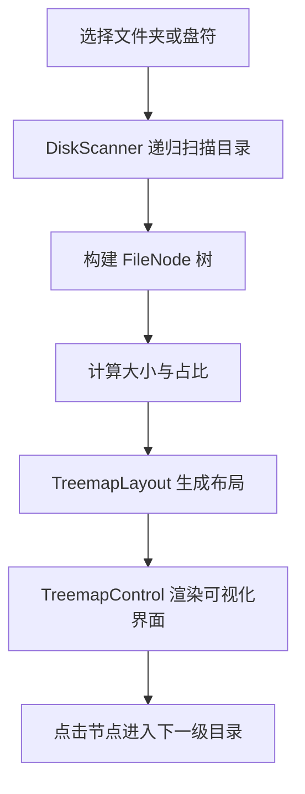
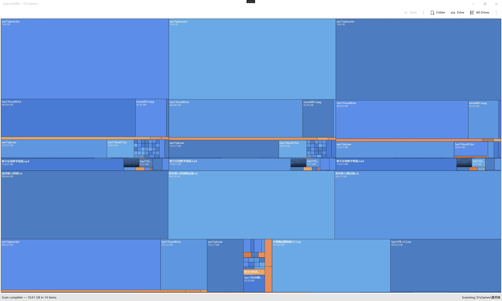

# SpaceSniffer

[](https://dotnet.microsoft.com/)
[](#)
[](#)

SpaceSniffer 是一个基于 **.NET 9** 和 **WPF** 的磁盘空间可视化分析工具，用 **Treemap（矩形树图）** 直观展示文件夹和文件的体积占比，帮助快速定位“大文件”和“空间黑洞”。

## 功能特性

- **Treemap 可视化**：用嵌套矩形展示目录结构和空间占用比例
- **文件夹 / 盘符扫描**：支持单个文件夹、单个盘符、全部盘符扫描
- **分层导航**：点击矩形可进入子目录，支持返回上一级视图
- **扫描进度提示**：状态栏实时显示当前扫描路径与扫描状态
- **取消扫描**：扫描过程中可随时取消
- **管理员提权**：遇到权限不足时，可提示以管理员身份重启并继续扫描
- **多线程扫描**：对子目录使用并行扫描，提高大目录场景下的响应速度
- **现代化界面**：使用 `ModernWpfUI` 提供更现代的桌面交互体验

## 技术栈

- `.NET 9`
- `WPF`
- `CommunityToolkit.Mvvm`
- `ModernWpfUI`

## 工作方式



## 运行要求

- Windows 10 / 11
- 已安装 `.NET 9 SDK`

## 快速开始

### 1. 克隆仓库

```bash
git clone https://github.com/s77zz/SpaceSniffer.git
cd SpaceSniffer
```

### 2. 还原依赖

```bash
dotnet restore
```

### 3. 运行项目

```bash
dotnet run --project .\SpaceSniffer\SpaceSniffer.csproj
```

### 4. 发布版本

```bash
dotnet publish .\SpaceSniffer\SpaceSniffer.csproj -c Release
```

## 使用说明

### 扫描入口

应用启动后，可通过顶部工具栏执行以下操作：

- **Folder**：选择某个文件夹进行扫描
- **Drive**：选择某个盘符进行扫描
- **All Drives**：扫描所有可用盘符
- **Back**：返回上一级导航节点
- **Cancel**：取消当前扫描任务

### 可视化交互

- 矩形面积越大，表示文件或文件夹占用空间越大
- 鼠标悬停可查看名称、大小和占比
- 单击文件夹矩形可钻取进入子目录
- 状态栏会显示当前路径与扫描进度信息

### 权限说明

某些系统目录或受保护目录可能需要管理员权限。
当应用检测到权限不足时，会提示以管理员身份重新启动，并自动带上待扫描路径。

## 界面截图

> 以下图片引用项目根目录下的 `screenshots/` 目录。

### 主界面



 

## 命令行参数

项目支持通过命令行直接启动扫描：

```bash
dotnet run --project .\SpaceSniffer\SpaceSniffer.csproj -- --scan "C:\"
```

如果是发布后的可执行文件，也可以这样调用：

```bash
SpaceSniffer.exe --scan "C:\Users\YourName"
```

## 项目结构

```
SpaceSniffer/
├─ SpaceSniffer/
│  ├─ Controls/        # Treemap 渲染、布局和辅助逻辑
│  ├─ Models/          # 文件节点模型
│  ├─ Services/        # 磁盘扫描、权限提升等服务
│  ├─ ViewModels/      # 主界面视图模型
│  ├─ Views/           # 对话框等视图
│  ├─ App.xaml
│  ├─ MainWindow.xaml
│  └─ SpaceSniffer.csproj
└─ README.md
```

## 核心实现

- `DiskScanner`：负责递归遍历目录、统计文件大小、并行扫描子目录
- `FileNode`：表示文件系统中的节点，保存名称、路径、大小、类型和子节点集合
- `TreemapLayout`：基于 Squarify 思路计算矩形布局
- `TreemapControl`：负责绘制 Treemap、命中测试、悬停提示和节点选择
- `MainViewModel`：负责扫描流程、导航状态、进度与命令绑定

## 当前特性边界

- 当前主要面向 **Windows 本地磁盘分析**
- 对无权限访问的文件或目录会自动跳过
- 扫描超大目录时，进度文本以“当前扫描路径”为主，不代表精确百分比进度

## 后续可扩展方向

- 文件类型分组统计
- 按扩展名聚合展示
- 删除 / 打开 / 定位到资源管理器
- 扫描结果导出
- 深色主题与配色自定义
- 扫描缓存与历史记录

## 贡献

欢迎提交 Issue 和 Pull Request，一起完善这个项目。

如果你准备把它作为 GitHub 展示项目，建议补充：

- 应用运行截图
- 演示 GIF
- 发布包下载链接
- License 文件
