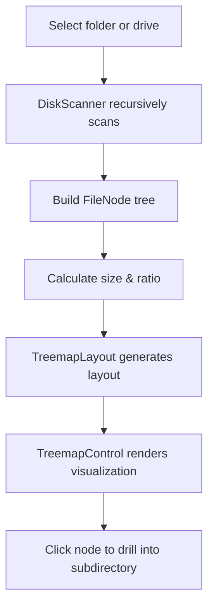

# SpaceSniffer

[](https://dotnet.microsoft.com/)
[](#)
[](#)

> **English** | [中文](README.zh.md)

SpaceSniffer is a disk space visualization and analysis tool built on **.NET 9** and **WPF**. It uses **Treemap** to visually display the size proportion of folders and files, helping you quickly locate large files and space hogs.

## Features

- **Treemap Visualization** — nested rectangles show directory structure and space usage
- **Folder / Drive Scanning** — scan individual folders, individual drives, or all drives
- **Hierarchical Navigation** — click a rectangle to drill into subdirectories, with back navigation support
- **Scan Progress** — real-time status bar shows the current scan path and progress
- **Cancel Scan** — cancel at any time during scanning
- **Admin Elevation** — prompts to restart as administrator when permission is insufficient
- **Multi-threaded Scanning** — parallel subdirectory scanning for faster large-directory performance
- **Modern UI** — powered by `ModernWpfUI` for a polished desktop experience

## Tech Stack

- `.NET 9`
- `WPF`
- `CommunityToolkit.Mvvm`
- `ModernWpfUI`

## How It Works



## Requirements

- Windows 10 / 11
- `.NET 9 SDK` installed

## Quick Start

### 1. Clone the repository

```bash
git clone https://github.com/s77zz/SpaceSniffer.git
cd SpaceSniffer
```

### 2. Restore dependencies

```bash
dotnet restore
```

### 3. Run the application

```bash
dotnet run --project .\SpaceSniffer\SpaceSniffer.csproj
```

### 4. Publish

```bash
dotnet publish .\SpaceSniffer\SpaceSniffer.csproj -c Release
```

## Usage

### Scan Entry Points

After launch, use the toolbar at the top:

- **Folder** — select a folder to scan
- **Drive** — select a drive to scan
- **All Drives** — scan all available drives
- **Back** — navigate back to the previous level
- **Cancel** — cancel the current scan

### Visual Interaction

- Larger rectangles mean larger files or folders
- Hover to view name, size, and percentage
- Click a folder rectangle to drill into its subdirectories
- The status bar shows the scan state on the left and the hovered node's full path on the right

### Permissions

Some system directories may require administrator privileges.
When access is denied, the app will prompt to restart as administrator with the target path preserved.

## Screenshots

> Images are referenced from the `screenshots/` directory in the project root.

### Main Window


## Command-line Arguments

Start a scan directly from the command line:

```bash
dotnet run --project .\SpaceSniffer\SpaceSniffer.csproj -- --scan "C:\"
```

Or with the published executable:

```bash
SpaceSniffer.exe --scan "C:\Users\YourName"
```

## Project Structure

```
SpaceSniffer/
├─ SpaceSniffer/
│  ├─ Controls/        # Treemap rendering, layout, and helpers
│  ├─ Models/          # File node model
│  ├─ Services/        # Disk scanner, elevation service, etc.
│  ├─ ViewModels/      # Main window view model
│  ├─ Views/           # Dialogs
│  ├─ App.xaml
│  ├─ MainWindow.xaml
│  └─ SpaceSniffer.csproj
└─ README.md
```

## Core Components

- `DiskScanner` — recursively traverses directories, aggregates file sizes, scans subdirectories in parallel
- `FileNode` — represents a file system node with name, path, size, type, and children
- `TreemapLayout` — computes rectangle layout using a squarified treemap algorithm
- `TreemapControl` — renders the treemap, handles hit-testing, hover tooltips, and node selection
- `MainViewModel` — manages scan flow, navigation state, progress, and command bindings

## Current Limitations

- Primarily designed for **Windows local disk analysis**
- Inaccessible files or directories are silently skipped
- When scanning very large directories, the progress text shows the current scan path rather than an exact percentage

## Future Directions

- File type grouping and statistics
- Grouped view by extension
- Delete / open / locate in File Explorer
- Export scan results
- Dark theme and color customization
- Scan cache and history

## Contributing

Issues and pull requests are welcome!

If you plan to use this as a GitHub showcase project, consider adding:

- Screenshots of the app in action
- Demo GIF
- Release download links
- License file
